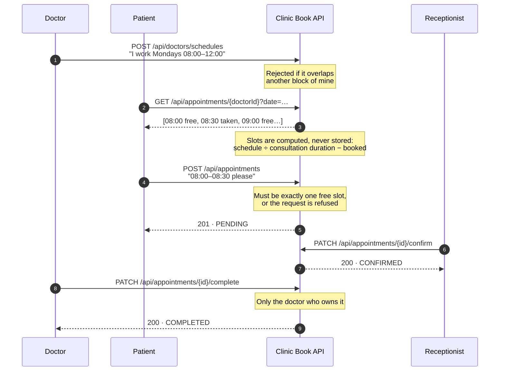
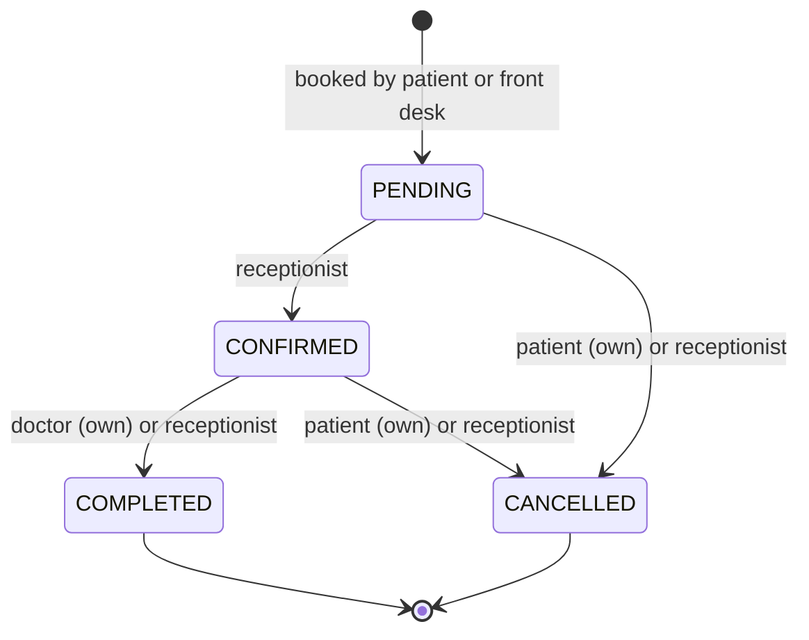
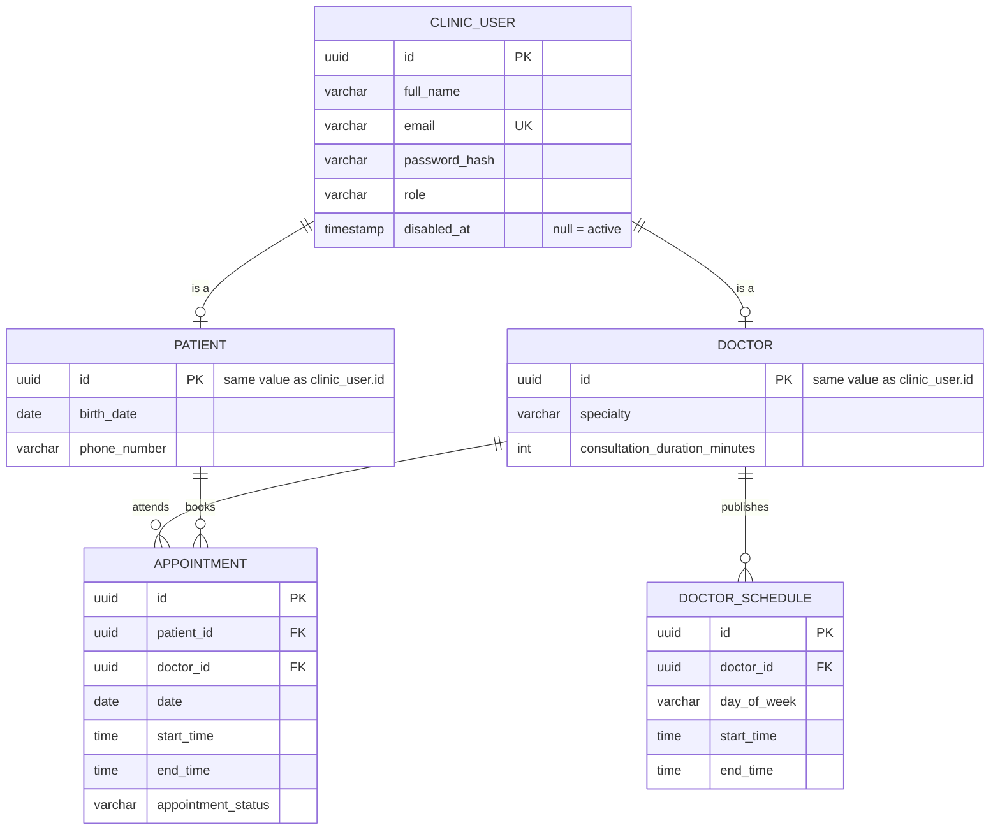

# Clinic Book

**A medical appointment scheduling API where the booking rules live in the domain, not in the controllers.**


Clinic Book is the backend of a clinic's booking system. A super admin onboards the staff, doctors publish the hours they work, patients book the free slots, and the front desk confirms, completes or cancels. It is a small domain with a surprising number of ways to get it wrong — which is exactly what makes it interesting to model properly.

**Frontend:** [`clinic-book-frontend`](https://github.com/migueldevplusplus/clinic-book-frontend) · **Docs:** `http://localhost:8080/swagger-ui.html` once running

---

## How a booking actually happens

This is the flow the whole system is built around. Everything else in this README is a detail of one of these steps.



### The slot grid

A doctor has a `consultationDurationMinutes`. Their published blocks are sliced into a grid of that size, and **an appointment is always exactly one cell of that grid** — never 45 minutes against a 30-minute doctor, never starting at 10:15 on a 10:00/10:30 grid.

```
Doctor's block:   08:00 ──────────────────────────────── 12:00
Grid (30 min):    │ 08:00 │ 08:30 │ 09:00 │ 09:30 │ …
Booked:                   │▓▓▓▓▓▓▓│
Offered:          │ free  │ taken │ free  │ free  │ …
```

Booking does not re-derive any of this. It asks the same availability function the patient just called, and accepts only what that function says is free — so what you see and what you can book can never disagree.

---

## The rules it enforces

| Rule | Where it lives | If broken |
|---|---|---|
| An appointment cannot be in the past | `Appointment` constructor | `400` |
| Start must be before end | `Appointment` constructor | `400` |
| Duration must equal the doctor's consultation length | `AppointmentService` | `400` |
| The slot must exist in the doctor's grid and be free | `AppointmentService` + `getAvailability` | `409` |
| A schedule block cannot overlap another of the same doctor | `DoctorSchedule.overlapsWith` | `409` |
| Only `PENDING` can be confirmed | `Appointment.confirm()` | `409` |
| Only `CONFIRMED` can be completed | `Appointment.complete()` | `409` |
| Cancelled appointments stop blocking their slot | `Appointment.isActive()` | — |
| A patient may only cancel their own appointment | `AppointmentService` | `403` |
| A doctor may only complete or delete what they own | `AppointmentService` / `DoctorService` | `403` |
| An email can only be registered once | `AuthService` | `409` |
| A disabled account cannot log in | `AuthService` | `403` |

Every one of these fails with the same JSON envelope:

```json
{ "message": "That time slot is not available", "status": 409, "timestamp": "2026-08-20T14:32:11.482" }
```

### Appointment lifecycle



The transitions are methods on `Appointment`. Calling `complete()` on a `PENDING` appointment throws regardless of who asked or which endpoint they came through.

---

## Who can do what

| | Patient | Doctor | Receptionist | Super admin |
|---|:--:|:--:|:--:|:--:|
| Sign up / log in | ✅ | ✅ | ✅ | ✅ |
| Browse doctors and availability | ✅ | ✅ | ✅ | ✅ |
| Book for themselves | ✅ | | | |
| Book on behalf of a patient | | | ✅ | |
| Confirm an appointment | | | ✅ | |
| Complete an appointment | | own only | ✅ | |
| Cancel an appointment | own only | | ✅ | |
| Publish / delete working hours | | own only | | |
| Register patients from the desk | | | ✅ | ✅ |
| Search patients | | | ✅ | ✅ |
| Onboard doctors and receptionists | | | | ✅ |
| List and disable accounts | | | | ✅ |

Roles come from the JWT and are checked with `@PreAuthorize`. Ownership ("own only") is checked separately in the service against the authenticated user id — the role gets you in the door, ownership decides which record you may touch.

---

## Architecture

Ports and adapters, with one rule enforced throughout: **`domain/` imports nothing from Spring, JPA or the web.**

```
web/            controllers · request & response records · GlobalExceptionHandler
      ↓ commands
application/    AuthService · AppointmentService · DoctorService · PatientService
      ↓ ports (interfaces)
domain/         Appointment · Doctor · DoctorSchedule · Patient · User · TimeSlot
      ↑ implements
infrastructure/ JPA entities · repositories · mappers · JWT · BCrypt · security config
```

Three DTO vocabularies, deliberately kept apart: `web/request` and `web/response` are the HTTP contract, `application/dtos` are commands and results, and `domain/model` are the objects with the rules. A JSON field rename never reaches the domain, and a domain refactor never breaks the API.

**Ports** live in `domain/port` and are implemented in `infrastructure`:

| Port | Hides |
|---|---|
| `UserRepositoryPort`, `PatientRepositoryPort`, `DoctorRepositoryPort`, `DoctorScheduleRepositoryPort`, `AppointmentRepositoryPort` | Spring Data JPA, PostgreSQL, entity↔model mapping |
| `PasswordHasherPort` | BCrypt |
| `JwtTokenProviderPort` | jjwt / HS256 |

**Two constructors per model.** A public one that enforces the invariants when something is created, and a private one reached through a static `reconstruct(...)` used only when loading from the database — so a row saved last year is not re-validated against today's rules like *"the date cannot be in the past"*.

---

## Data model



`patient.id` and `doctor.id` **are** the `clinic_user.id` — a shared primary key. One person, one identity, one row per role-specific extension. Schedules are weekly and recurring (`day_of_week`, not a date), so a doctor describes their week once instead of filling a calendar.

Accounts are disabled, never deleted (`disabled_at`): appointment history has to survive the account.

The schema is 7 Flyway migrations and Hibernate runs with `ddl-auto=validate` — it checks the mapping against the real schema at startup and refuses to boot on drift, rather than quietly altering tables.

---

## Running it

**Everything at once** (API + PostgreSQL):

```bash
git clone https://github.com/migueldevplusplus/clinic-book-app.git
cd clinic-book-app
docker compose up --build
```

API on `:8080`, database on `:5433`, Flyway builds the schema and seeds a super admin on first boot.

**Just the database, app from your IDE:**

```bash
docker compose up -d db
./mvnw spring-boot:run
```

**Configuration** — the committed values are development defaults; anything real overrides them with environment variables:

| Variable | Default |
|---|---|
| `SPRING_DATASOURCE_URL` | `jdbc:postgresql://localhost:5433/clinicbook` |
| `SPRING_DATASOURCE_USERNAME` / `_PASSWORD` | `postgres` / `postgres` |
| `JWT_SECRET` | a clearly-labelled dev key — **must be replaced**, HS256 needs ≥ 256 bits |
| `JWT_EXPIRATION` | `86400000` (24 h) |

### Trying it out

Open **`http://localhost:8080/swagger-ui.html`**, log in through `POST /api/auth/login`, paste the returned token into **Authorize**, and every protected endpoint becomes clickable from the page.

From the terminal it looks like this:

```bash
# The seeded super admin bootstraps everyone else
TOKEN=$(curl -s -X POST localhost:8080/api/auth/login \
  -H 'Content-Type: application/json' \
  -d '{"email":"<super-admin-email>","password":"<super-admin-password>"}' | jq -r .token)

# Onboard a cardiologist who sees patients in 30-minute slots
curl -X POST localhost:8080/api/doctors -H "Authorization: Bearer $TOKEN" \
  -H 'Content-Type: application/json' \
  -d '{"fullName":"Ana Rivas","email":"ana@clinic.com","rawPassword":"supersecret123",
       "specialty":"CARDIOLOGY","consultationDurationMinutes":30}'
```

---

## API map

`/api/auth` — `POST /signup` · `POST /login` · `POST /receptionists` · `GET /users` · `PATCH /users/{id}/disable`

`/api/doctors` — `POST /` · `GET /` · `GET /?specialty=` · `GET /{id}` · `GET /{id}/schedules` · `POST /schedules` · `DELETE /{id}/schedules`

`/api/patients` — `POST /` · `GET /?query=`

`/api/appointments` — `POST /` · `POST /receptionist` · `GET /{doctorId}?date=` *(availability)* · `GET /my` · `GET /agenda?date=` · `GET /upcoming-agenda` · `GET /all?date=` · `GET /{doctorId}/receptionist?date=` · `PATCH /{id}/confirm` · `PATCH /{id}/complete` · `PATCH /{id}/cancel` *(+ `/receptionist` variants)*

Everything except signup, login and the docs requires `Authorization: Bearer <token>`. Swagger UI has the full request and response shapes.

---

## Tests

```bash
./mvnw test
```

`AppointmentServiceTest` drives the booking rules through mocked ports — state transitions, ownership violations, duration mismatches, off-grid start times, taken slots, and cancelled appointments releasing their slot again. Milliseconds, no database, because the rules do not need one.

`ClinicBookApplicationTests` is the opposite end: it boots the whole application against a throwaway PostgreSQL 16 container via Testcontainers, so every build also replays the full Flyway chain on an empty database and catches a broken migration before anyone else does. **Docker must be running for this one.**

---

## Known limits

Being explicit about what this does not do yet:

- **Concurrency.** Availability is checked and then the row is inserted. Two requests for the last free slot can both pass the check. The fix is a partial unique index on `(doctor_id, date, start_time)` over active appointments, so the database has the final word.
- **No pagination.** `GET /api/auth/users`, patient search and a patient's own history return everything. Fine at clinic scale, wrong at hospital scale. Doing it properly here means defining a `PageQuery`/`PageResult` in the domain rather than leaking Spring's `Pageable` through the ports.
- **No rescheduling.** Moving an appointment today means cancelling and booking again.
- **No reminders or notifications.**
- Test coverage is deep on appointments and thin on `AuthService` and `DoctorService`.
- CORS is pinned to `http://localhost:5173` for the development frontend.

---

## Decisions worth explaining

**Why hexagonal for a CRUD-looking app?** Because it is not CRUD. The value is in the rules — grids, overlaps, ownership, state transitions — and keeping them in plain Java means they are tested in milliseconds and readable without knowing Spring. The cost is real: more files, mappers to maintain, and friction whenever a framework feature (like `Pageable`) wants to reach through the ports. That trade paid off here; on a genuine CRUD service it would not.

**Why compute slots instead of storing them?** A `slots` table would need updating whenever a doctor changes their hours or their consultation length, and would drift out of sync the first time that failed. Deriving them from schedules and bookings means there is no second source of truth to reconcile.

**Why does booking call the availability function?** Because the alternative — booking re-implementing "is this valid?" — is how the UI and the API start disagreeing. One function answers the question, both paths use it.

**Why `PATCH` for confirm/complete/cancel?** They are partial state transitions on an existing resource, not replacements of it.

**Why Flyway with `validate` instead of `ddl-auto=update`?** Because `update` silently changes production schemas and cannot express a data migration or a drop. Versioned SQL is reviewable, repeatable, and runs identically on the integration test container.

---

Built by [Miguel Mora](https://github.com/migueldevplusplus).
