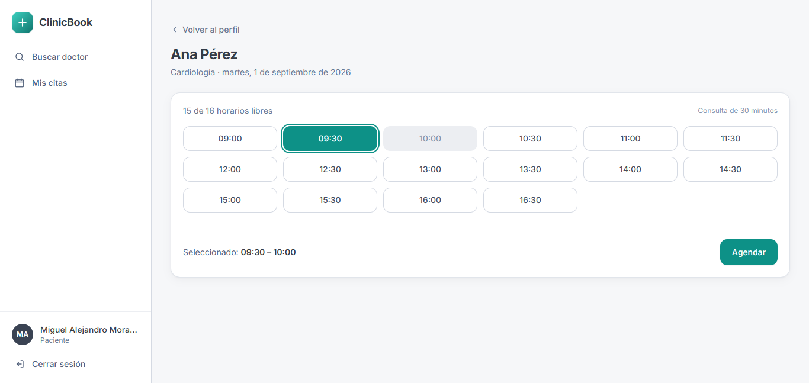
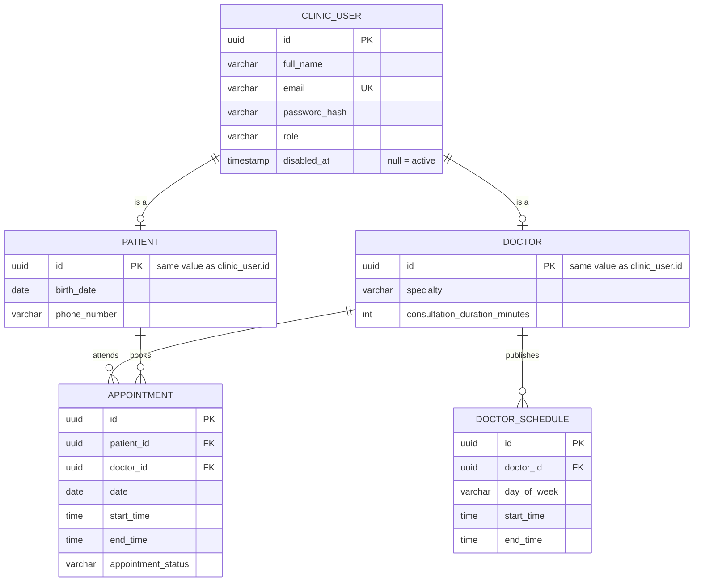
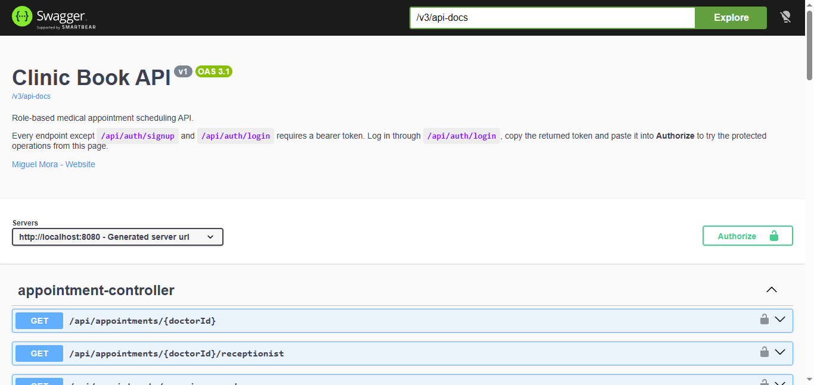

# Clinic Book

**Medical appointment scheduling API — Java 21, Spring Boot 4, hexagonal architecture.**




<sub>Slot availability served by the API: the grid is derived from the doctor's weekly schedule and 30-minute consultation length, and 10:00 is offered as unavailable because it is already booked.</sub>

---

## Live Demo

| | URL |
|---|---|
| API (Render) | <https://clinic-book-app.onrender.com/api> |
| Swagger UI | <https://clinic-book-app.onrender.com/swagger-ui.html> |
| Web client (Vercel) | <https://clinic-book-frontend.vercel.app> |

The React client lives in [clinic-book-frontend](https://github.com/migueldevplusplus/clinic-book-frontend).

Both run on free tiers that sleep when idle, so the first request after a quiet period takes up to two minutes while the service wakes.

---

## Overview

Backend for a private clinic's booking system. Patients browse a doctor's free slots and book them, doctors publish the hours they work and close their appointments, and the front desk confirms, cancels and books on behalf of walk-ins.

Built with Spring Boot 4 and **hexagonal architecture**: the domain package has no framework imports, so the booking rules are plain Java and tested without a database. Data lives in PostgreSQL with a schema versioned by Flyway, and the API is documented with OpenAPI.

- **Status:** feature-complete for the core booking flow
- **Language:** Java 21
- **Reference client:** [`clinic-book-frontend`](https://github.com/migueldevplusplus/clinic-book-frontend) — a small React app used to exercise the API

---

## Key Features

- **Four roles with real authorization** — `PATIENT`, `DOCTOR`, `RECEPTIONIST`, `SUPER_ADMIN`, enforced per endpoint
- **Stateless JWT authentication** with BCrypt password hashing
- **Weekly doctor schedules** with overlap detection
- **Computed slot availability** — free/busy times are derived from the doctor's schedule and consultation length, never stored
- **Booking validated against availability** — a request must match exactly one free slot, so the API and the UI can never disagree
- **Appointment lifecycle as a state machine** — `PENDING → CONFIRMED → COMPLETED`, cancellable from any active state, enforced inside the domain
- **Ownership checks beyond roles** — a doctor may only close their own appointments, a patient only cancel theirs
- **Soft account disabling** — users are disabled, never deleted, so appointment history survives
- **Versioned schema** with Flyway and `ddl-auto=validate`
- **Consistent error contract** — every domain exception maps to a meaningful HTTP status
- **Containerized** — one command brings up the API and the database

---

## Tech Stack

| Layer | Technology |
|---|---|
| Language | Java 21 |
| Framework | Spring Boot 4.1.0 — Web MVC, Security, Validation, Data JPA |
| Database | PostgreSQL 16 |
| Migrations | Flyway |
| Auth | jjwt 0.11.5 (HS256) + BCrypt |
| Docs | springdoc-openapi 3.1.0 (Swagger UI) |
| Testing | JUnit 5, Mockito, Testcontainers |
| Build & runtime | Maven, Docker Compose |

---

## Architecture

Ports and adapters, with one rule enforced throughout: **`domain/` imports nothing from Spring, JPA or the web.**

```
com.clinicbook
├── domain/            Models with the business rules, enums, exceptions, ports
├── application/       Use cases (services) + commands and results
├── infrastructure/    JPA entities, repositories, mappers, JWT, security config
└── web/               Controllers, request/response records, exception handler
```

- **Ports** (`domain/port`) invert every external dependency: repositories, password hashing and token issuing are interfaces the domain owns and `infrastructure` implements.
- **Three DTO vocabularies** stay separate — web requests/responses, application commands/results, and domain models — so a JSON rename never reaches the domain.
- **Two constructors per model**: a public one that enforces invariants on creation, and a private one reached through `reconstruct(...)` when loading from the database, so old rows are not revalidated against creation-time rules.

---

## Data Model



`patient.id` and `doctor.id` **are** the `clinic_user.id` — a shared primary key, so one person is one identity with role-specific data in its own table. Schedules are weekly and recurring, so a doctor describes their week once instead of filling a calendar.

---

## Roles & Permissions

| | Patient | Doctor | Receptionist | Super admin |
|---|:--:|:--:|:--:|:--:|
| Browse doctors and availability | ✅ | ✅ | ✅ | ✅ |
| Book for themselves | ✅ | | | |
| Book on behalf of a patient | | | ✅ | |
| Confirm an appointment | | | ✅ | |
| Complete an appointment | | own only | ✅ | |
| Cancel an appointment | own only | | ✅ | |
| Publish / delete working hours | | own only | | |
| Register and search patients | | | ✅ | ✅ |
| Onboard doctors and receptionists | | | | ✅ |
| List and disable accounts | | | | ✅ |

Roles come from the JWT and are checked with `@PreAuthorize`. Ownership is verified separately in the service against the authenticated user id.

---

## Getting Started

**Prerequisites:** JDK 21 and Docker Desktop.

### Option A — everything in Docker

```bash
git clone https://github.com/migueldevplusplus/clinic-book-app.git
cd clinic-book-app
docker compose up --build
```

### Option B — database in Docker, app from your IDE

```bash
docker compose up -d db
./mvnw spring-boot:run
```

API on `http://localhost:8080`, PostgreSQL on `5433`. Flyway builds the schema on first boot.

### The first administrator

Every account is created by someone already signed in, which leaves the first administrator with nobody to create it. Set `ADMIN_EMAIL` and `ADMIN_PASSWORD` and `SuperAdminInitializer` creates that account at startup — but only while the database holds no administrator, so restarts are a no-op and a password changed later is never overwritten.

Leave them unset and nothing is seeded, which is what the tests and a throwaway database want.

### Configuration

Committed values are development defaults; every one is overridden by an environment variable.

| Variable | Default |
|---|---|
| `SPRING_DATASOURCE_URL` | `jdbc:postgresql://localhost:5433/clinicbook` |
| `SPRING_DATASOURCE_USERNAME` / `_PASSWORD` | `postgres` / `postgres` |
| `JWT_SECRET` | a labelled dev key — **replace it in any real deployment** |
| `JWT_EXPIRATION` | `86400000` (24 h) |
| `ADMIN_EMAIL` / `ADMIN_PASSWORD` | empty — no administrator is seeded |
| `ADMIN_FULL_NAME` | `Super Admin` |
| `CORS_ALLOWED_ORIGINS` | `http://localhost:5173` — comma-separated |
| `JPA_SHOW_SQL` | `false` |

---

## Security & Auth

- Stateless sessions — no server-side session store
- `JwtAuthFilter` validates the bearer token and loads the user's UUID, so controllers never trust an id sent by the client
- `@EnableMethodSecurity` + `@PreAuthorize` on every protected handler
- Ownership violations return `403` through `InvalidOwnerException`, not just role mismatches
- Auth failures return the same JSON error shape as the rest of the API
- CORS restricted to the frontend origin

**Flow:** `POST /api/auth/signup` or `/login` → returns a JWT → send it as `Authorization: Bearer <token>`.

---

## API Reference

Open **`http://localhost:8080/swagger-ui.html`**, log in through `/api/auth/login`, paste the token into **Authorize**, and every endpoint becomes clickable from the page.



| Group | Endpoints |
|---|---|
| `/api/auth` | `POST /signup` · `POST /login` · `POST /receptionists` · `GET /users` · `PATCH /users/{id}/disable` |
| `/api/doctors` | `POST /` · `GET /` · `GET /?specialty=` · `GET /{id}` · `GET /{id}/schedules` · `POST /schedules` · `DELETE /{id}/schedules` |
| `/api/patients` | `POST /` · `GET /?query=` |
| `/api/appointments` | `POST /` · `POST /receptionist` · `GET /{doctorId}?date=` *(availability)* · `GET /my` · `GET /agenda?date=` · `GET /upcoming-agenda` · `GET /all?date=` · `PATCH /{id}/confirm` · `PATCH /{id}/complete` · `PATCH /{id}/cancel` |

Every failure returns the same envelope:

```json
{ "message": "That time slot is not available", "status": 409, "timestamp": "2026-08-21T14:32:11.482" }
```

| Exception | Status |
|---|---|
| Overlaps, duplicate email, taken slot, illegal state transition | `409` |
| Not found (appointment, schedule, doctor, user) | `404` |
| Ownership violation, disabled account | `403` |
| Invalid credentials | `401` |
| Validation errors, invalid schedule or duration | `400` |

---

## Testing

```bash
./mvnw test
```

- **`AppointmentServiceTest`** — the booking rules through mocked ports: state transitions, ownership, duration mismatches, off-grid start times, taken slots, and cancelled appointments releasing their slot. No database, milliseconds.
- **`ClinicBookApplicationTests`** — boots the whole application against a throwaway PostgreSQL 16 container via Testcontainers, replaying the full Flyway chain on an empty schema on every build. *Requires Docker running.*

---

## Why It Is Built This Way

- **Hexagonal architecture** — the value here is the rules, not the CRUD; keeping them free of Spring makes them fast to test and readable without framework knowledge.
- **Computed availability instead of a slots table** — no denormalized state to keep in sync when a doctor changes their hours.
- **Booking reuses the availability function** — one source of truth, so the UI and the API cannot drift apart.
- **Rich domain models** — `Appointment.confirm()` and `DoctorSchedule.overlapsWith()` keep invariants in one place instead of scattered `if`s.
- **Flyway + `validate`** — schema changes are reviewed, versioned SQL; Hibernate refuses to boot on drift instead of altering tables silently.
- **`PATCH` for confirm/complete/cancel** — partial state transitions, not resource replacements.

---

## Known Limits

- **Account disabling is one-way and not immediate.** Disabling blocks future logins, but a token issued beforehand keeps working until it expires, since `CustomUserDetails` does not carry the account state. There is also no endpoint to re-enable an account, and nothing stops the super admin from disabling the only super admin — which would leave no one able to onboard staff. Completing it means adding `User.enable()`, a re-enable endpoint, a guard against self-disabling, and an `isEnabled()` check in `JwtAuthFilter`.
- **Concurrency:** availability is checked and then inserted, so two requests for the last slot can both pass. The fix is a partial unique index on `(doctor_id, date, start_time)` over active appointments.
- **No pagination** on the listing endpoints — fine at clinic scale, wrong at hospital scale.
- **No rescheduling** — cancel and book again.
- Test coverage is deep on appointments, thin on `AuthService` and `DoctorService`.

---

Built by [Miguel Mora](https://github.com/migueldevplusplus).
